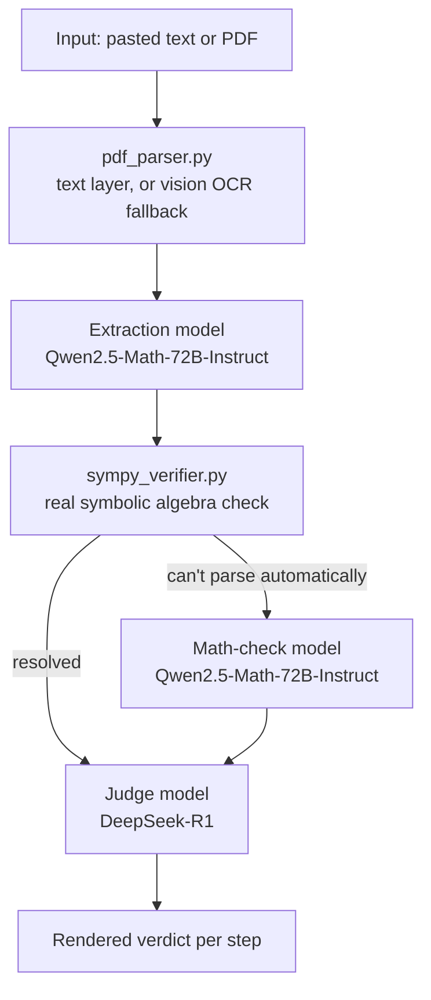

# ProofMesh

**Try it live: [URL here once deployed]**

ProofMesh catches algebra errors buried in multi-step derivations — the
kind a tired reviewer skims straight past — using a real symbolic math
engine to check the work, not an AI model's opinion of whether it looks
right.

## See it catch a real error

This is an actual run, not a mockup:

```
Input:
  (x+1)^2
  x^2 + 2x + 1
  x^2 + 2x + 2      <- error seeded here

ProofMesh output:
  Step 1: consistent with the previous step.
  Step 2: flagged — difference simplifies to -1, expected 0.
```

The third line has a wrong constant. SymPy doesn't guess that something
"looks off" — it algebraically confirms the two steps aren't equal, which
is exactly the kind of confident-but-wrong error a pure-LLM checker can
miss or hallucinate past.

## Why this exists

Most "AI proof checkers" ask a language model whether math looks correct
— which means they inherit that model's tendency to sound certain while
being wrong. ProofMesh splits the job instead: a deterministic algebra
engine verifies, and AI models handle only what they're actually good at —
reading messy input and explaining a result in plain language.

## Architecture



Only steps SymPy can't automatically resolve get escalated to a second
model — not the whole derivation, and not by default. Every AI call in
the app routes through one client (`featherless_client.py`).

**Files:**

| File | Job |
|---|---|
| `app.py` | The Streamlit page; runs every stage in order and displays results |
| `schemas.py` | The shared data shapes every other file agrees on |
| `prompts.py` | The exact instructions given to each AI model |
| `sympy_verifier.py` | The real math-checking logic — SymPy, not AI |
| `featherless_client.py` | Every AI model call in the app, in one place |
| `pdf_parser.py` | Turns an uploaded PDF into plain text |

## How to use it

1. Open the live link above.
2. Paste a derivation, or switch to **Upload PDF** — scanned pages with no
   selectable text are OCR'd automatically.
3. Click **Run audit**.
4. Each step renders with its verdict: consistent, flagged (SymPy-
   confirmed), or unverifiable, with a plain-language explanation for
   anything short of "consistent."

## Features

- **Real symbolic verification** — a deterministic algebraic check, not a
  model's guess.
- **Targeted escalation** — a second AI opinion only on the specific steps
  SymPy genuinely can't resolve.
- **Text or PDF input**, with automatic vision-OCR fallback for scanned
  pages.
- **Transparent verdicts** — every step shows *how* it was resolved, not
  just a final pass/fail.

## Known limitations

- SymPy's check is a symbolic-simplification check, not a full theorem
  prover — some true equivalences (certain trig or log identities) may
  need the escalation step rather than being resolved automatically.
- PDF OCR is capped at a limited number of pages per run, to stay within
  API rate limits and credit budgets.
- Escalation and judge output depend on the model returning well-formed
  JSON; malformed responses surface as a visible error, by design, rather
  than failing silently.

## Setup

```bash
git clone <your-repo-url>
cd proofmesh
pip install -r requirements.txt
```

Set `PROVIDER` and the matching API key as environment variables, a local
`.env` file, or Streamlit secrets:

```
PROVIDER=featherless
FEATHERLESS_API_KEY=your-key-here
```

```bash
streamlit run app.py
```

**Deploying:** on [share.streamlit.io](https://share.streamlit.io), point
a new app at this repo with main file path `app.py`, and paste the same
`PROVIDER` / API key pair into **Advanced settings** as TOML.

## Built with

- [SymPy](https://www.sympy.org/) — symbolic mathematics engine
- [Featherless.ai](https://featherless.ai/) — model inference
- [Streamlit](https://streamlit.io/) — application framework
- [pypdf](https://pypdf.readthedocs.io/) / [PyMuPDF](https://pymupdf.readthedocs.io/) — PDF parsing
- [latex2sympy2](https://pypi.org/project/latex2sympy2/) — LaTeX parsing fallback
